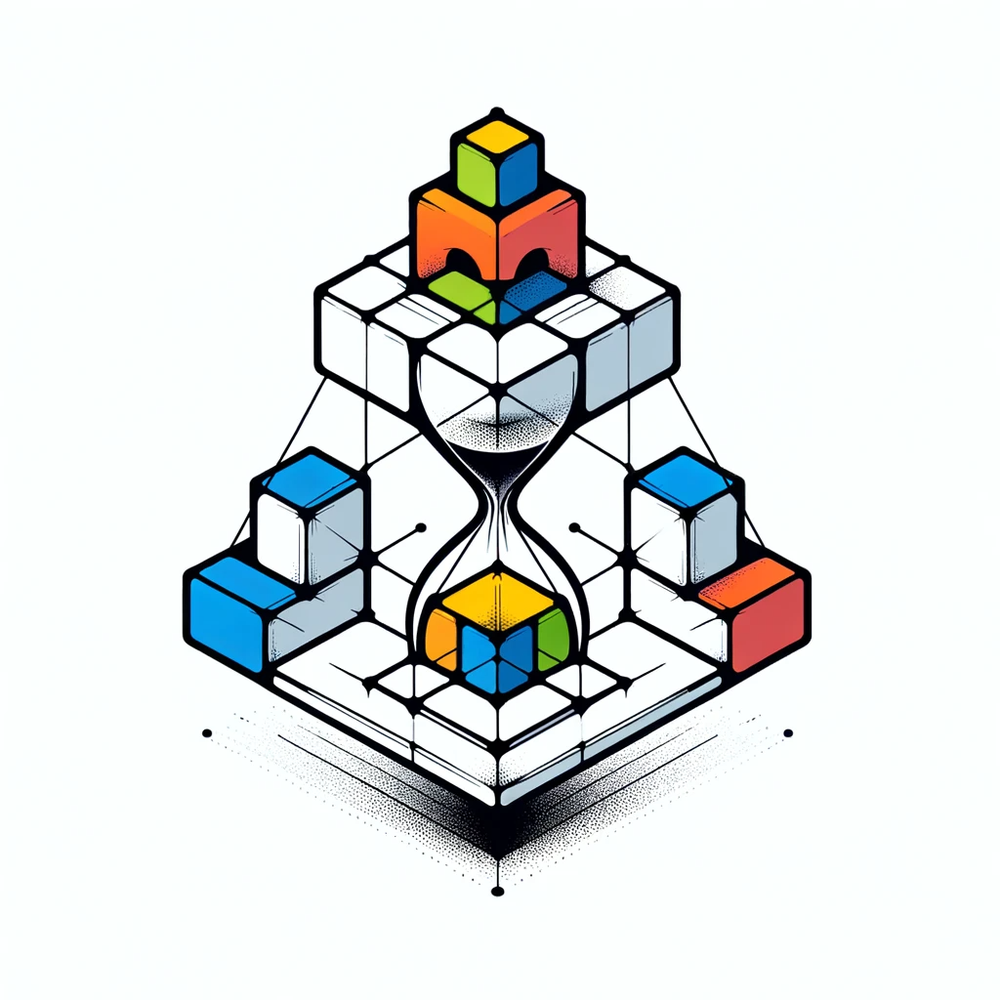

<div align="center">
  
</div>

[](https://goreportcard.com/report/github.com/shengyanli1982/workqueue/v2)
[](https://github.com/shengyanli1982/workqueue/actions)
[](https://pkg.go.dev/github.com/shengyanli1982/workqueue/v2)
[](https://deepwiki.com/shengyanli1982/workqueue)

# WorkQueue v2

`workqueue` is a production-oriented queue toolkit for Go teams that want high throughput, clear failure semantics, and predictable behavior under concurrency.

You can start with a simple FIFO queue, then evolve to delayed, prioritized, leased, retryable, dead-letter, timed, bounded-blocking, or rate-limited execution without changing your mental model.

## Why Teams Choose WorkQueue

- **One library, full queue lifecycle**: from basic async jobs to backpressure, retries, leases, and dead letters.
- **Built for hot paths**: object pooling (`sync.Pool`), short lock critical sections, and `O(log n)` scheduling structures.
- **Clear reliability semantics**: explicit errors, shutdown guarantees, idempotent mode, retry policy, and lease expiration recovery.
- **Cross-platform confidence**: CI runs `go test -v ./...` on Linux, macOS, and Windows.
- **Evidence over slogans**: the repo includes `163` tests and `68` benchmarks (current tree count).

## Queue Portfolio

| Queue                  | Best for                   | Key capability                                                    |
| ---------------------- | -------------------------- | ----------------------------------------------------------------- |
| `Queue`                | Standard async processing  | FIFO with optional idempotent dedup (`dirty` + `processing` sets) |
| `DelayingQueue`        | Deferred execution         | Delay-based enqueue with background puller                        |
| `PriorityQueue`        | SLA-based scheduling       | Priority-driven ordering                                          |
| `RateLimitingQueue`    | Producer throttling        | Limiter-driven delay (token bucket provided)                      |
| `RetryQueue`           | Transient failure recovery | Retry with pluggable policy (exponential built-in)                |
| `DeadLetterQueue`      | Failure isolation          | Dead-letter capture, ack, and requeue                             |
| `LeasedQueue`          | At-least-once workers      | Lease ID, ack/nack/extend, expired lease requeue                  |
| `BoundedBlockingQueue` | Backpressure control       | Capacity-limited blocking `Put/Get` with `context.Context`        |
| `TimerQueue`           | Scheduled tasks            | Exact-time enqueue (`PutAt`/`PutAfter`) and cancellation          |

## Quick Start

```bash
go get github.com/shengyanli1982/workqueue/v2
```

```go
package main

import (
	"errors"
	"fmt"

	wkq "github.com/shengyanli1982/workqueue/v2"
)

func main() {
	q := wkq.NewQueue(
		wkq.NewQueueConfig().WithValueIdempotent(),
	)
	defer q.Shutdown()

	_ = q.Put("job-1")
	if err := q.Put("job-1"); errors.Is(err, wkq.ErrElementAlreadyExist) {
		fmt.Println("dedup works: duplicate job ignored")
	}

	value, err := q.Get()
	if err != nil {
		fmt.Println("get failed:", err)
		return
	}
	fmt.Println("consumed:", value)
	q.Done(value)

	_, err = q.Get()
	if errors.Is(err, wkq.ErrQueueIsEmpty) {
		fmt.Println("queue is empty now")
	}
}

```

```bash
$ go run demo.go
dedup works: duplicate job ignored
consumed: job-1
queue is empty now
```

## Performance Notes

WorkQueue is optimized for sustained throughput and memory stability:

- Queue/list nodes are recycled via `sync.Pool` to reduce allocation pressure.
- In non-idempotent mode, node allocation is done outside the lock to shorten lock hold time.
- Delayed and timed scheduling is backed by an internal red-black-tree structure.
- Retry path avoids unnecessary delay-heap hops when delay is sub-millisecond.

Run local benchmarks:

```bash
# go test -run=^$ -bench . -benchmem .
goos: windows
goarch: amd64
pkg: github.com/shengyanli1982/workqueue/v2
cpu: 12th Gen Intel(R) Core(TM) i5-12400F
BenchmarkDelayingQueue_Put-12                            9660178               113.7 ns/op            72 B/op          1 allocs/op
BenchmarkDelayingQueue_PutWithDelay-12                   7223593               204.3 ns/op            72 B/op          1 allocs/op
BenchmarkDelayingQueue_Get-12                           43128854                26.13 ns/op           25 B/op          0 allocs/op
BenchmarkDelayingQueue_PutAndGet-12                     28233632                43.19 ns/op            8 B/op          0 allocs/op
BenchmarkDelayingQueue_PutWithDelayAndGet-12             7812835               173.3 ns/op            23 B/op          1 allocs/op
BenchmarkPriorityQueue_Put-12                            8790770               152.1 ns/op            71 B/op          1 allocs/op
BenchmarkPriorityQueue_PutWithPriority-12                8905075               147.6 ns/op            71 B/op          1 allocs/op
BenchmarkPriorityQueue_Get-12                           35805717                38.58 ns/op           30 B/op          0 allocs/op
BenchmarkPriorityQueue_PutAndGet-12                     27909182                43.27 ns/op            7 B/op          0 allocs/op
BenchmarkPriorityQueue_PutWithPriorityAndGet-12         28891783                41.20 ns/op            8 B/op          0 allocs/op
BenchmarkQueue_Put-12                                   15871357                71.97 ns/op           71 B/op          1 allocs/op
BenchmarkQueue_Get-12                                   46386312                28.14 ns/op           20 B/op          0 allocs/op
BenchmarkQueue_PutAndGet-12                             30368137                40.18 ns/op            8 B/op          0 allocs/op
BenchmarkQueue_Idempotent_Put-12                         3958620               390.7 ns/op           192 B/op          3 allocs/op
BenchmarkQueue_Idempotent_Get-12                         3932238               402.2 ns/op           136 B/op          0 allocs/op
BenchmarkQueue_Idempotent_PutAndGet-12                   4843734               315.1 ns/op           100 B/op          1 allocs/op
BenchmarkQueue_Idempotent_PutGetDone-12                  8454412               134.9 ns/op             8 B/op          0 allocs/op
BenchmarkQueue_Idempotent_DuplicatePut-12               58935621                18.90 ns/op            0 B/op          0 allocs/op
BenchmarkDeadLetterQueue_PutGetAck-12                    7876915               202.6 ns/op           464 B/op          4 allocs/op
BenchmarkRetryQueue_RetryPath-12                         8142548               143.9 ns/op             8 B/op          0 allocs/op
BenchmarkLeasedQueue_GetAck-12                          10255945               119.1 ns/op            15 B/op          1 allocs/op
BenchmarkBoundedBlockingQueue_PutGet-12                  6371674               189.4 ns/op             8 B/op          0 allocs/op
BenchmarkTimerQueue_PutAtGet-12                         24577572                46.05 ns/op            8 B/op          0 allocs/op
BenchmarkTimerQueue_Cancel-12                           10201149               115.2 ns/op            16 B/op          1 allocs/op
BenchmarkRateLimitingQueue_Put-12                       15276328                75.14 ns/op           72 B/op          1 allocs/op
BenchmarkRateLimitingQueue_PutWithLimited-12             5905118               246.6 ns/op           136 B/op          2 allocs/op
BenchmarkRateLimitingQueue_Get-12                       38158107                26.46 ns/op           28 B/op          0 allocs/op
BenchmarkRateLimitingQueue_PutAndGet-12                 28648164                42.73 ns/op            8 B/op          0 allocs/op
BenchmarkRateLimitingQueue_PutWithLimitedAndGet-12       5478241               229.2 ns/op           135 B/op          2 allocs/op
```

## Reliability by Design

- **Shutdown safety**: all queue variants expose `Shutdown()` with guarded one-time close behavior.
- **Typed failure contracts**: explicit errors such as `ErrQueueIsClosed`, `ErrQueueIsEmpty`, `ErrRetryExhausted`, `ErrLeaseNotFound`.
- **Recovery primitives**: retry with policy, dead-letter workflows, lease-expiration requeue.
- **Observability hooks**: callbacks for put/get/done, delay, priority, retry, dead-letter, and rate-limited events.

## Example Projects

Runnable demos:

- [`examples/queue`](./examples/queue/demo.go)
- [`examples/delaying_queue`](./examples/delaying_queue/demo.go)
- [`examples/priority_queue`](./examples/priority_queue/demo.go)
- [`examples/ratelimiting_queue`](./examples/ratelimiting_queue/demo.go)
- [`examples/retry_queue`](./examples/retry_queue/demo.go)
- [`examples/dead_letter_queue`](./examples/dead_letter_queue/demo.go)
- [`examples/leased_queue`](./examples/leased_queue/demo.go)
- [`examples/timer_queue`](./examples/timer_queue/demo.go)
- [`examples/bounded_blocking_queue`](./examples/bounded_blocking_queue/demo.go)

Run any demo directly:

```bash
go run ./examples/<queue_dir>
```

## Architecture

## API Reference

- GoDoc: <https://pkg.go.dev/github.com/shengyanli1982/workqueue/v2>
