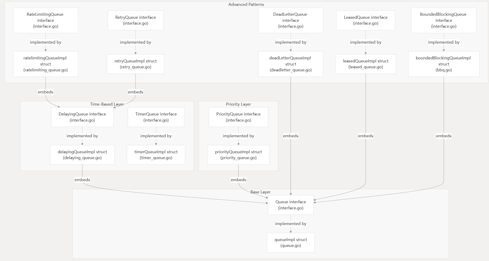

<div align="center">
  
</div>

[](https://goreportcard.com/report/github.com/shengyanli1982/workqueue/v2)
[](https://github.com/shengyanli1982/workqueue/actions)
[](https://pkg.go.dev/github.com/shengyanli1982/workqueue/v2)
[](https://deepwiki.com/shengyanli1982/workqueue)

# WorkQueue v2

`workqueue` is a production-oriented queue toolkit for Go teams that want high throughput, clear failure semantics, and predictable behavior under concurrency.

You can start with a simple FIFO queue, then evolve to delayed, prioritized, leased, retryable, dead-letter, timed, bounded-blocking, or rate-limited execution without changing your mental model.

## Why Teams Choose WorkQueue

- **One library, full queue lifecycle**: from basic async jobs to backpressure, retries, leases, and dead letters.
- **Built for hot paths**: object pooling (`sync.Pool`), short lock critical sections, and `O(log n)` scheduling structures.
- **Clear reliability semantics**: explicit errors, shutdown guarantees, idempotent mode, retry policy, and lease expiration recovery.
- **Cross-platform confidence**: CI runs `go test -v ./...` on Linux, macOS, and Windows.
- **Evidence over slogans**: the repo includes `286` tests and `93` benchmarks (current tree count).

## Queue Portfolio

| Queue                  | Best for                   | Key capability                                                                                                             |
| ---------------------- | -------------------------- | -------------------------------------------------------------------------------------------------------------------------- |
| `Queue`                | Standard async processing  | FIFO with optional idempotent dedup (queued vs. in-processing tracked separately); blocking `GetWithContext`, graceful `ShutdownWithDrain`, `InFlight` inspection |
| `DelayingQueue`        | Deferred execution         | Event-driven exact scheduling (heap-top timer, no polling jitter, zero wakeups when idle) and per-item `CancelDelay`       |
| `PriorityQueue`        | SLA-based scheduling       | Priority-driven ordering                                                                                                   |
| `RateLimitingQueue`    | Producer throttling        | Limiter-driven delay (built-in token bucket, per-item exponential backoff, `MaxOf` composition)                             |
| `RetryQueue`           | Transient failure recovery | Retry with pluggable policy (exponential built-in); automatic dead-letter promotion on exhaustion (`WithDeadLetterQueue`)  |
| `DeadLetterQueue`      | Failure isolation          | Dead-letter capture, ack, and requeue                                                                                       |
| `LeasedQueue`          | At-least-once workers      | Lease ID, ack/nack/extend, expired lease requeue, plus `OnNack` reason callback and `LeaseInfos` inspection                 |
| `BoundedBlockingQueue` | Backpressure control       | Capacity-limited blocking `Put/Get` with `context.Context`                                                                 |
| `TimerQueue`           | Scheduled tasks            | Exact-time enqueue (`PutAt`/`PutAfter`), cancellation, and in-place update on same-value reschedule                         |

## Quick Start

Requires Go 1.21+ (CI matrix: 1.21.x–1.25.x on Linux, macOS, and Windows).

```bash
go get github.com/shengyanli1982/workqueue/v2
```

```go
package main

import (
	"errors"
	"fmt"

	wkq "github.com/shengyanli1982/workqueue/v2"
)

func main() {
	q := wkq.NewQueue(
		wkq.NewQueueConfig().WithValueIdempotent(),
	)
	defer q.Shutdown()

	_ = q.Put("job-1")
	if err := q.Put("job-1"); errors.Is(err, wkq.ErrElementAlreadyExist) {
		fmt.Println("dedup works: duplicate job ignored")
	}

	value, err := q.Get()
	if err != nil {
		fmt.Println("get failed:", err)
		return
	}
	fmt.Println("consumed:", value)
	q.Done(value)

	_, err = q.Get()
	if errors.Is(err, wkq.ErrQueueIsEmpty) {
		fmt.Println("queue is empty now")
	}
}

```

```bash
$ go run demo.go
dedup works: duplicate job ignored
consumed: job-1
queue is empty now
```

## Performance Notes

WorkQueue is optimized for sustained throughput and memory stability:

- Queue/list nodes are recycled via `sync.Pool` to reduce allocation pressure.
- In non-idempotent mode, node allocation is done outside the lock to shorten lock hold time.
- Delayed and timed scheduling is backed by an internal red-black-tree structure.
- Retry path avoids unnecessary delay-heap hops when delay is sub-millisecond.
- Idempotent dedup sets are type-specialized (`string`/`int`/`int64`/`uint64` fast paths) to avoid interface boxing on the hot path; mixed-type writes fall back to a generic map.
- `DelayingQueue` scheduling is event-driven: an exact heap-top timer replaces fixed-interval polling, so the scheduler only wakes when an item is due and an idle queue costs nothing.

Run local benchmarks:

```bash
# go test -run=^$ -bench . -benchmem .
goos: darwin
goarch: arm64
pkg: github.com/shengyanli1982/workqueue/v2
cpu: Apple M1 Max
BenchmarkDelayingQueue_Put-10                          15149115         74.52 ns/op       72 B/op       1 allocs/op
BenchmarkDelayingQueue_PutWithDelay-10                  6478314        206.7 ns/op        72 B/op       1 allocs/op
BenchmarkDelayingQueue_Get-10                          53975540         23.85 ns/op       26 B/op       0 allocs/op
BenchmarkDelayingQueue_PutAndGet-10                    31127731         38.05 ns/op        8 B/op       0 allocs/op
BenchmarkDelayingQueue_PutWithDelayAndGet-10            6919269        183.1 ns/op        13 B/op       1 allocs/op
BenchmarkPriorityQueue_Put-10                          11429500        122.2 ns/op        71 B/op       1 allocs/op
BenchmarkPriorityQueue_PutWithPriority-10              11293912        119.9 ns/op        71 B/op       1 allocs/op
BenchmarkPriorityQueue_Get-10                          40435636         30.46 ns/op       23 B/op       0 allocs/op
BenchmarkPriorityQueue_PutAndGet-10                    27141594         44.29 ns/op        7 B/op       0 allocs/op
BenchmarkPriorityQueue_PutWithPriorityAndGet-10        27087933         43.58 ns/op        7 B/op       0 allocs/op
BenchmarkQueue_Put-10                                  20985027         68.83 ns/op       71 B/op       1 allocs/op
BenchmarkQueue_Get-10                                  61497463         20.49 ns/op       24 B/op       0 allocs/op
BenchmarkQueue_PutAndGet-10                            31525368         37.72 ns/op        7 B/op       0 allocs/op
BenchmarkQueue_Idempotent_Put-10                        5599609        301.0 ns/op       134 B/op       3 allocs/op
BenchmarkQueue_Idempotent_Get-10                        4624273        299.1 ns/op        87 B/op       0 allocs/op
BenchmarkQueue_Idempotent_PutAndGet-10                  5815224        268.2 ns/op        60 B/op       1 allocs/op
BenchmarkQueue_Idempotent_PutGetDone-10                11277523        106.8 ns/op         8 B/op       0 allocs/op
BenchmarkQueue_Idempotent_DuplicatePut-10              82216417         14.68 ns/op        0 B/op       0 allocs/op
BenchmarkQueue_Idempotent_Done-10                       8934493        201.0 ns/op         0 B/op       0 allocs/op
BenchmarkDeadLetterQueue_PutGetAck-10                   4378929        395.3 ns/op       463 B/op       4 allocs/op
BenchmarkRetryQueue_RetryPath-10                        8205392        146.0 ns/op         8 B/op       0 allocs/op
BenchmarkLeasedQueue_GetAck-10                          7345975        163.9 ns/op        15 B/op       1 allocs/op
BenchmarkBoundedBlockingQueue_PutGet-10                 8203533        146.3 ns/op         7 B/op       0 allocs/op
BenchmarkTimerQueue_PutAtGet-10                         8555770        139.2 ns/op         7 B/op       0 allocs/op
BenchmarkTimerQueue_Cancel-10                           8732342        148.5 ns/op        16 B/op       1 allocs/op
BenchmarkRateLimitingQueue_Put-10                      20291320         71.49 ns/op       71 B/op       1 allocs/op
BenchmarkRateLimitingQueue_PutWithLimited-10            3438927        346.8 ns/op       135 B/op       2 allocs/op
BenchmarkRateLimitingQueue_Get-10                      56330112         21.86 ns/op       24 B/op       0 allocs/op
BenchmarkRateLimitingQueue_PutAndGet-10                31137356         38.61 ns/op        8 B/op       0 allocs/op
BenchmarkRateLimitingQueue_PutWithLimitedAndGet-10      3293270        349.8 ns/op       135 B/op       2 allocs/op
```

Idempotent-mode `Get`/`Done` now carry in-flight tracking (the dual queued/in-processing sets), so they cost more than the plain FIFO path; the overhead scales with the number of in-flight elements.

## Graceful Shutdown & Blocking Consumption

**Graceful shutdown.** All nine queue variants implement `ShutdownWithDrain(ctx context.Context) error`, exposed through the optional `DrainableQueue` interface (io.Closer-style type assertion):

- Once draining starts, new `Put`s are rejected (`ErrQueueIsClosed`) while `Get`/`Done` keep working so consumers can finish.
- The call waits until queued items and in-flight items (`Get`-ed but not yet `Done`-ed) complete, then closes. On ctx timeout or cancel it force-closes and returns `ctx.Err()`.
- Non-idempotent queues without drain tracking only wait for queued items to empty; in-flight elements are not visible there by design.
- Delayed/timed items that have not fired are discarded at final close (counted in `discardedDelayed`); an item is never delivered earlier than promised.

**Blocking consumption.** Queues support `GetWithContext(ctx context.Context) (any, error)`, exposed through the optional `BlockingGetQueue` interface:

- Blocks until a value is available, ctx completes, or the queue closes; it never returns `ErrQueueIsEmpty`.
- Wakeup latency measured at p99 ~20µs locally.
- Opt-in: queues that never call it pay nothing on the default path.
- `LeasedQueue` additionally provides `GetWithLeaseWithContext(ctx, timeout)` via type assertion.

**Idempotent in-flight semantics.** In idempotent mode, a `Put` for an element that is in processing (`Get`-ed, not yet `Done`-ed) is accepted, and the element is re-enqueued at `Done` time — the controller resync pattern.

```go
ctx, cancel := context.WithTimeout(context.Background(), 5*time.Second)
defer cancel()

q := wkq.NewQueue(wkq.NewQueueConfig().WithValueIdempotent())

// Blocking get: waits for a value, ctx completion, or queue close.
bq := q.(wkq.BlockingGetQueue)
go func() {
	value, err := bq.GetWithContext(ctx)
	if err == nil {
		fmt.Println("consumed:", value)
		q.Done(value)
	}
}()

_ = q.Put("job-1")

// Graceful shutdown: reject new puts, wait for queued and in-flight work.
if err := q.(wkq.DrainableQueue).ShutdownWithDrain(ctx); err != nil {
	fmt.Println("forced close:", err) // ctx timeout or cancel
}
```

## Observability

`MetricsRecorder` is a built-in recorder with no third-party dependencies. It implements all eight callback interfaces, so a single recorder can be passed to `WithCallback` on any queue config:

```go
rec := wkq.NewMetricsRecorder()
q := wkq.NewQueue(wkq.NewQueueConfig().WithCallback(rec))

// ... run workload ...

s := rec.Snapshot() // Adds, Gets, Dones, Retries, RetryExhausteds, PullErrors, ScheduleErrors, Unfinished
depth := q.Len()    // depth stays pull-style: combine it with the counters yourself
```

- The hot path is atomic increments only: zero allocations, no third-party dependencies.
- `Snapshot()` reports cumulative counts; one recorder can serve a single queue or aggregate several.

Inspection APIs (all return lock-internal copies, safe to iterate without touching queue internals):

| API                                                  | Reports                                                                                                          |
| ---------------------------------------------------- | ---------------------------------------------------------------------------------------------------------------- |
| `LeasedQueue.LeaseInfos()`                           | every live lease: lease ID, held value, deadline                                                                 |
| `RetryQueue.RequeueCounts()`                         | retry counts keyed by `RetryKeyFunc`                                                                             |
| `InFlight()` (optional `InFlightQueue` interface)    | in-processing elements in idempotent mode (`Get`-ed, not yet `Done`-ed); returns nil in non-idempotent mode      |

## Retry & Rate-limiting Additions

**Rate limiters** (all implement `Limiter`):

- `NewBucketRateLimiterImpl(rate, burst)` — global token bucket.
- `NewItemExponentialFailureRateLimiter(base, max)` — per-item exponential backoff: first wait is `base`, doubling on each failure, capped at `max`. Values must be comparable (they serve as map keys).
- `NewMaxOfRateLimiter(limiters...)` — compose limiters, taking the longest wait.
- Limiters that keep per-item state can implement the optional `LimiterForgetter` interface; holders call `Forget` after an item is processed to remove its backoff state and keep internal tables from growing unbounded.

**Dead-letter bridge.** `RetryQueueConfig.WithDeadLetterQueue(dlq, sourceName)` forwards items to a dead-letter queue automatically once the retry policy is exhausted:

```go
dlq := wkq.NewDeadLetterQueue(wkq.NewDeadLetterQueueConfig())

q := wkq.NewRetryQueue(
	wkq.NewRetryQueueConfig().
		WithPolicy(wkq.NewExponentialRetryPolicy(10*time.Millisecond, time.Second, 3)).
		WithDeadLetterQueue(dlq, "retry-main"),
)
```

When the policy refuses further retries, the value is put into the dead-letter queue with `Attempts`, `LastError`, and `FailedAt` filled in, and `Retry` still returns `ErrRetryExhausted`. Without this option, exhaustion behavior is unchanged.

## Reliability by Design

- **Shutdown safety**: every queue variant exposes `Shutdown()` (immediate close with guarded one-time behavior, semantics unchanged) and `ShutdownWithDrain(ctx)` (graceful close; see [Graceful Shutdown & Blocking Consumption](#graceful-shutdown--blocking-consumption)).
- **In-flight safety**: in idempotent mode, queued and in-processing elements are tracked in separate sets, so a re-`Put` of an in-flight element is accepted and the element is safely re-enqueued at `Done` time.
- **Typed failure contracts**: explicit errors such as `ErrQueueIsClosed`, `ErrQueueIsEmpty`, `ErrRetryExhausted`, `ErrLeaseNotFound`.
- **Recovery primitives**: retry with policy, dead-letter workflows, lease-expiration requeue.
- **Observability hooks**: callbacks for put/get/done, delay, priority, retry, dead-letter, rate-limited, and nack events; see [Observability](#observability) for the built-in recorder and inspection APIs.

## Example Projects

Runnable demos:

- [`examples/queue`](./examples/queue/demo.go)
- [`examples/delaying_queue`](./examples/delaying_queue/demo.go)
- [`examples/priority_queue`](./examples/priority_queue/demo.go)
- [`examples/ratelimiting_queue`](./examples/ratelimiting_queue/demo.go)
- [`examples/retry_queue`](./examples/retry_queue/demo.go)
- [`examples/dead_letter_queue`](./examples/dead_letter_queue/demo.go)
- [`examples/leased_queue`](./examples/leased_queue/demo.go)
- [`examples/timer_queue`](./examples/timer_queue/demo.go)
- [`examples/bounded_blocking_queue`](./examples/bounded_blocking_queue/demo.go)

Run any demo directly:

```bash
go run ./examples/<queue_dir>
```

## Architecture



## API Reference

- GoDoc: <https://pkg.go.dev/github.com/shengyanli1982/workqueue/v2>

## DeepWiki

- <https://deepwiki.com/shengyanli1982/workqueue>
